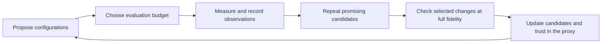

# Tabletop Game Balancing: Autoresearch with Expensive Feedback

**2nd place in the 2026 Tabletop Games Balancing Competition (IEEE CoG), with
3652.5 / 4000 points.** The [official results](https://balance-competition.tabletopgames.ai/)
confirm the placing; the exact score and submitted rules are archived in
[`results/winning_submission.json`](results/winning_submission.json).

We explored black-box optimization and tabular foundation models as building
blocks for autoresearch. The practical problem was familiar: a full evaluation
was too expensive to use for every idea, so we researched with smaller samples.
Then we had to work out which improvements survived a more expensive evaluation.

Synthefy's Nori was one of several search methods we tried, and it contributed
useful candidates. Our judgment is that measurement design, repeated evaluation,
and checking transfer mattered more to the final result. We did not run the
ablations needed to assign a numerical contribution to each component. This
repository shares the methods, mistakes, and outcome as a learning resource.

[The ML story](#the-ml-story) · [The search methods](#where-tabular-foundation-models-fit)
· [Running it](#running-it) · [Competition reference](#competition-reference)
· [Submission ledger](#submission-ledger)

## The ML story

Full training runs, large simulation campaigns, and comprehensive evaluations
can make each research iteration expensive. A common response is to reduce the
budget: train for fewer steps, use less data, or evaluate on fewer samples. That
makes experimentation possible. It also creates a second question alongside
optimization: how informative is the cheaper experiment about the objective we
ultimately care about?

[Karpathy's autoresearch](https://github.com/karpathy/autoresearch) makes the
appeal of a short automated loop concrete: an agent edits a training program,
runs a fixed five-minute experiment, and compares validation performance. When
that budget is the actual objective, improving it is directly useful. When the
intended deployment uses a larger training or evaluation budget, transfer to
that setting needs its own evidence.

Our view is that useful autoresearch must choose **what to try, how much to spend
on it, and what evidence is sufficient to keep it**. A faster proposal loop can
also select more lucky observations or optimize a misleading proxy more
aggressively. An expressive search model does not by itself resolve that risk.
This is a recognized issue in [multi-fidelity optimization with unreliable
information sources](https://proceedings.mlr.press/v206/mikkola23a.html).

For reasoning about it, write a cheap measurement as:

```text
cheap_score(x) = expected_full_score(x) + fidelity_bias(x) + sampling_noise
```

This is a decomposition, not a fitted model in this repo. Repeating a measurement
can reduce uncertainty from sampling noise. It does not establish that the
fidelity-dependent bias is small. Choosing the maximum among many noisy scores
also makes the selected winner's apparent advantage especially suspect.

The competition let us study this problem through game simulations. Our
low-budget experiments changed the number of simulated games; we did not test
scaling laws, larger neural networks, or full model-training runs. The lessons
for those settings are a research hypothesis, while the observations below come
from this particular evaluation problem. The software automates configuration
search and repeated evaluation; the campaign's strategic decisions and final
submissions still involved human judgment.

## A concrete expensive black box

We chose rules for Dominion, Exploding Kittens, 7 Wonders, and Can't Stop. The
evaluator ran fixed AI agents and scored how closely their matchup win rates
matched a target. A balanced result could require a stronger agent to win more
often; making every matchup 50/50 was not the objective. Each game contributed
up to 1000 points. See the [official scoring specification](https://balance-competition.tabletopgames.ai/games).

| Evaluation budget | Simulated games | Approximate time observed per evaluation |
|---|---:|---|
| `fast` | 36 | 2–15 minutes |
| `medium` | 360 | 15–40 minutes |
| `full` | 3,600 | Hours; used for leaderboard entries |

Timings varied by game, configuration, and infrastructure. Our campaign notes
record approximately 9,000 evaluations across the search. Candidate proposals
were cheap enough that deciding which ones deserved another simulation became
an important part of the work.



## What transferred, and what did not

The numbers in this section are historical campaign notes. The complete
observation database and the script for the reported leave-one-out experiment
are not checked in. The final bundle and submission ledger are preserved;
a fresh clone can run the tooling but cannot independently reconstruct every
historical statistic below.

**Selecting noisy winners inflated the apparent result.** An early bundle made
from each game's best individual observation read about **3781**, then about
**3485** when remeasured. That gap combines selection effects and measurement
uncertainty; the notes do not isolate their individual contributions. We moved
toward repeated means and racing survivors to greater observation depth.
[`evaluate.py`](src/ttbalance/evaluate.py) and
[`cache.py`](src/ttbalance/cache.py) implement that process.

**The useful evaluation budget depended on the game and candidate set.** A
historical diagnostic compared the range of medium means against typical
within-configuration variation:

| Game | Range of medium means | Median within-config SD | Heuristic ratio |
|---|---:|---:|---:|
| Exploding Kittens | 104.5 | 21.2 | 8.5 |
| 7 Wonders | 47.2 | 22.1 | 3.7 |
| Can't Stop | 25.3 | 13.1 | 3.3 |
| Dominion | 18.0 | 12.7 | 2.5 |

The ratio is approximately `range / (SD / sqrt(3))`, matching the diagnostic in
`scripts/reproduce.sh`. It helped us prioritize Exploding Kittens. It is not a
statistical test of ranking reliability or a measurement of fast-to-full
transfer: it depends on which configurations were sampled and assumes a common
three-repeat depth even when actual counts differ.

**An attractive small-sample relationship could still mislead us.** Early notes
called Exploding Kittens' fast/medium relationship negative (−0.79 on a small
rank-correlation sample). A later calculation on 18 paired configurations was
+0.43. Those estimates used different samples and should not be treated as a
stable property of the game. Similarly, two matching Dominion examples led us
to trust `fast`; replacing Dominion with a higher-fast candidate subsequently
lost **32.4 leaderboard points**. Local agreement did not justify that decision.

**Changing one game made the evidence easier to interpret.** The v6→v7 bundle
changed three games, improving the medium estimate by **44.9** but the full score
by only **1.6**. Reverting just 7 Wonders from v7 then gained **30.6** at full
fidelity, despite a recorded medium change of **−14.8**. This motivated smaller,
attributable submission changes. It does not prove that multi-game changes
transfer worse in general, or that any one full evaluation is noise-free.
The [ledger below](#submission-ledger) keeps the actual comparisons visible.

We also inspected score components through [`modal_localapi.py`](modal_localapi.py).
One Exploding Kittens diagnostic showed a matchup-distance problem with zero
first-player deviation; the Elite/Good matchup read 33.3% against a 60% target.
That suggested hypotheses about the rules. Cheap diagnostic improvements still
needed confirmation: two such directions were rejected at `medium`. The
[official games page](https://balance-competition.tabletopgames.ai/games) now
publishes target matrices, so reading logs is useful for the measured outcomes,
not the sole way to learn the targets.

## Where tabular foundation models fit

A search history naturally forms a table: a configuration's parameters are the
features, and its measured score is the label. We explored several ways to use
that history:

| Searcher | How it proposes the next experiments |
|---|---|
| `random` | Uniform samples; a simple baseline |
| `hill` | Local parameter changes and restarts |
| `ea` | Population selection, crossover, mutation, and repeated evaluation |
| `pbil` | Update a distribution over parameter choices from successful samples |
| `nori` | Predict candidate scores with a tabular foundation model and select a batch |

These implementations share the evaluator in [`optimizers/`](src/ttbalance/optimizers/).
We did not compare them on the real games with identical starting data and equal
compute budgets. The offline mock checks implementation behavior; it cannot
establish which searcher is strongest on the competition objective.

[Nori](https://github.com/Synthefy/synthefy-nori) predicts new tabular rows using
labelled examples as context, without task-specific gradient training. Its
predictive output includes quantiles. That interface made it convenient to
refresh a surrogate as measurements arrived. Data preparation, inference, and
the search policy still have costs and choices; calling `fit` is not evidence
that the entire optimization problem has become free of tuning.

In our medium-fidelity campaigns, the loop in
[`surrogate.py`](src/ttbalance/optimizers/surrogate.py) did the following:

1. Encode parameters as numbers and subset membership indicators.
2. Supply the observed configurations and their mean `medium` scores to Nori.
3. Propose roughly 2,000 unseen configurations from random draws and mutations.
4. Rank them with `q50 + kappa * max(q90 - q50, 0)` and select about 10, penalizing
   near-duplicates within the batch.
5. Evaluate those candidates, reobserve thinly measured leaders, and update the
   mutation rate after success or failure streaks.

The quantile bonus is an exploration heuristic. We did not establish that these
quantiles were calibrated on this search distribution or that their spread
isolated uncertainty about the mean from simulation noise. Likewise, the
adaptive mutation rate is a simple heuristic inspired by trust-region search;
it does not inherit another optimizer's theoretical guarantees.

The campaign notes attribute three of the four final configurations to direct
medium search without prior fast measurements. This is evidence that the loop
produced useful configurations. It does not measure its advantage over PBIL,
a Gaussian process, or another surrogate.

### Can a weak cheap signal still help?

We also explored predicting `medium` from **parameters plus the fast score**.
A weak proxy can be useful as an input if it adds predictive information beyond
the parameters. That usefulness must be tested; it is not guaranteed by the
model's capacity to represent a complicated relationship.

[`multifidelity.py`](src/ttbalance/multifidelity.py) uses configurations with
medium labels and adds their fast means where available. Missing fast scores
remain missing. It does not turn fast-only configurations into medium-labelled
training examples. [`mf_screen.py`](scripts/mf_screen.py) screens candidates at
fast, uses the model to shortlist them, and requests three medium observations
for each selected candidate.

A historical leave-one-out comparison on 18 paired Exploding Kittens
configurations reported medium-score MAE of **28.21** using parameters alone,
**25.97** after adding the fast score, and **35.10** for a mean baseline. We treat
that as a small, encouraging proxy-prediction result. It did not establish a
statistically reliable improvement in search, a lower total compute cost, or
better full-fidelity performance. Those require prospective evaluation.

### Our position on the model and the research loop

We see tabular foundation models as a promising, convenient surrogate option
when configurations can be represented as rows and labels are expensive. Their
prior learned across tasks may help make use of a small experiment history.
They still need informative labels, a suitable representation, and validation
on the task being optimized. No prior supplies the missing full-fidelity
observations needed to establish transfer here.

The current loop gives each configuration mean one label regardless of repeat
count, so it does not explicitly weight a seven-repeat mean more than a
single observation. Confirmation handles part of that problem outside the
surrogate. A noise-aware GP, a tree-based model, and simpler search methods
remain credible alternatives; this experiment did not rule them out.

Our strongest lesson for autoresearch is to make the evidence loop explicit.
Record which evaluator produced a score, revisit apparent winners, and spend
some budget checking the target objective. Automating those decisions and
validating the proxy can matter as much as improving candidate proposals. In
this campaign, we believe they mattered more.

To turn that view into a stronger empirical claim, we would next compare
searchers from the same initial data under equal evaluation cost, repeat those
campaigns across seeds, and compare their selected candidates on fresh full
runs. Separately, we would ablate the fast-score feature and the quantile bonus,
and measure how well cheap experiments retain the candidates that win at full
fidelity. These are proposed experiments, not results of this repository.

## Running it

Use Python 3.10 or later. Install the base dependencies in a virtual environment:

```bash
python3 -m venv .venv
source .venv/bin/activate
python -m pip install -r requirements.txt
```

Optional dependencies are separate: `requirements-dev.txt` adds NumPy and pandas
for the complete offline test suite; `requirements-nori.txt` adds the Nori SDK;
`requirements-modal.txt` adds Modal. Install both Nori and Modal requirements into
`.venv-nori` before using `scripts/search_modal_medium.sh`. This repo imports
`NoriRegressor` from the local `synthefy-nori` package. Its public checkpoint is
downloaded on first use; hosted inference is a separate upstream option. See
[Nori installation and model access](https://github.com/Synthefy/synthefy-nori#install)
for runtime requirements. Modal requires its own account and deployment setup.

```bash
./scripts/reproduce.sh check       # offline: tests + an optimiser run, no API needed
./scripts/reproduce.sh evaluator   # start 10 local evaluator containers (needs Docker)
./scripts/reproduce.sh search      # search at medium, one loop per game
# Stop the search loops before confirmation uses their container pool.
./scripts/reproduce.sh confirm     # knockout the leaders to 7 measurements
./scripts/reproduce.sh diagnose    # per-game noise check from collected measurements
./scripts/reproduce.sh bundle      # print the submission JSON
```

`check` installs the base Python dependencies and runs the tests and a complete
optimiser loop against [`mock.py`](src/ttbalance/mock.py), a stand-in for the
API that runs offline. Install `requirements-dev.txt` to exercise every numerical
test. The later steps need a real evaluator and take hours; they run new searches
rather than reconstructing the exact competition trajectory.

For Modal: `modal deploy modal_localapi.py`, then pass `--backend modal`.

Search and confirmation scripts default to `medium`; `RUN_TYPE=fast` explicitly
selects cheap runs. `DRY_RUN=1 ./scripts/search_all.sh` and
`DRY_RUN=1 ./scripts/verify_all.sh` print the exact commands without starting
containers or evaluations. `PASSES=1` bounds each search loop to one pass.
`reproduce.sh check` uses a temporary directory for its mock cache, entries, and
PBIL state, and returns a failure status when a test or optimizer run fails.

### Experiment storage and existing results

CLI observations, entries, and optimizer state now live under:

```text
results/experiments/<experiment>/<backend>/<evaluator-version>/
  cache.sqlite
  entries/<game>.json
  state/<run-type>/pbil_<game>.json
```

Use `--experiment` and `--evaluator-version` (or `TTB_EXPERIMENT` and
`TTB_EVALUATOR_VERSION`) consistently for search, verify, best, status, and
screening. Version labels default to `unversioned`; set a stable label for the
actual evaluator image digest or revision whenever that evaluator changes
(for example, `sha256-<hex>` using a hyphen instead of a colon).
Mock directories include their seed because it changes the simulated objective.
`--results-dir` / `TTB_RESULTS_DIR` relocates all generated artifacts.

An explicit `--cache` / `TTB_CACHE` must match the stored backend, mock settings,
experiment, and evaluator version. Legacy SQLite files without provenance are
preserved but cannot be reused by evaluation commands automatically: their
observations may mix mock and real runs. Start a new experiment/cache; keep the
old database for separate inspection. Existing `results/entries` and
`results/state` files are not imported. The archived winning submission remains
in `results/winning_submission.json`.

`--budget` is shared across games within search, verify, and probe. It counts
calls to the evaluator's `score` method, including failed calls; internal
transport retries are not separately metered. `bench` grants the stated budget
to each optimizer/game case for comparison. Budget-limited confirmation reports
incomplete repeat counts and does not promote an underconfirmed entry.

Within one process, duplicate batch members and evaluators sharing a `Cache`
object reuse in-flight work. Separate processes must still use disjoint container
pools. Backend errors are reported and counted; a batch with no usable scores
fails, and unexpected programming errors propagate.


## Competition reference

This section consolidates the former competition notes. The competition has
finished. The [official timeline](https://balance-competition.tabletopgames.ai/),
checked on 2026-09-09, lists opening on 28 February, the end of testing on
31 March, submissions closing on **1 September**, and the winner announcement
on 3 September 2026. The closing date supersedes the 25 August date in our
earlier notes.

### Rules and scoring

The fixed agents are Elite (tuned MCTS), Good (MCTS with half Elite's time
budget), OSLA (one-step greedy), and Random. Dominion, Exploding Kittens, and
Can't Stop are evaluated with two players; 7 Wonders uses four. The first three
have a 50% first-player target; 7 Wonders has simultaneous turns and no
first-player term. Scoring measures distance from specified matchup targets,
with per-game scaling. The [official formulas and matrices](https://balance-competition.tabletopgames.ai/games)
are the reference for the scoring convention.

Parameter definitions are in [`config/valid_params.json`](config/valid_params.json),
from the [organisers' examples](https://github.com/longhousedev/balance-comp-examples).

| Game identifier | Parameters | Subset constraints |
|---|---:|---|
| `Dominion` | 10 | `CARDS`: exactly 10 of 26 kingdom cards |
| `ExplodingKittens` | 14 | One boolean; the remaining parameters are integers |
| `Wonders7` | 29 | `wonders`: 4–7 of the seven wonders |
| `CantStop` | 13 | Column maxima, `COLUMNS_TO_WIN`, and `MARKERS` |

Use `PILES_EXHAUSTED_FOR_GAME_END` for Dominion, as in the checked-in config and
current official table. Earlier notes recorded a spelling discrepancy. The
`probe` command can check acceptance against a chosen evaluator; it consumes
real evaluations when used with a live backend.

### Evaluator APIs

[`client.py`](src/ttbalance/client.py) implements the local, local-pool, hosted,
and Modal backends. The hosted base configured here is
`https://balance-competition.tabletopgames.ai/api/`. The
[API documentation](https://balance-competition.tabletopgames.ai/documentation)
describes submission, polling, and retrieval:

```text
POST /submit_run       {game, params, api_key, run_type} -> {runID}
GET  /query_run?id=N                                  -> {run_status}
GET  /retrieve_result?id=N&api_key=KEY                 -> {score, runID}
```

Generate a hosted API key through the competition site's user settings and set
`TTB_API_KEY`. The client polls about every ten seconds and retrieves a result
after `complete`; it also tolerates pending states such as `created`. HTTP 400
indicates rejected input and 401 a rejected key. Hosted availability after the
competition is separate from the offline tooling.

The [local evaluator](https://balance-competition.tabletopgames.ai/localsetup)
uses a synchronous endpoint without an API key:

```bash
docker run --rm -p 3000:3000 longhousedev/localapi
```

```text
POST http://localhost:3000/api/run_game
     {game, params, run_type, timeout?} -> {score} or {error}
```

`timeout` is in milliseconds. During the campaign, useful parallelism came from
multiple containers with one request in flight per container. One recorded
six-CPU run took 2352 seconds versus 2379 seconds on one CPU; that single
comparison informed our deployment choice, not a general scaling result.
[`localapi.sh`](scripts/localapi.sh) manages the local pool,
[`cloud_localapi.sh`](scripts/cloud_localapi.sh) bootstraps a VM pool, and
[`modal_localapi.py`](modal_localapi.py) runs evaluations as Modal function calls.

The evaluation API did not submit competition entries. Final bundles went
through the website's Submit Entry form, which produced the leaderboard scores.

## Submission ledger

Recorded submissions, ordered by full score rather than submission time. Each
row's change description names the experiment; its baseline is not necessarily
the preceding row. Exact decimal scores below come from our submission record;
the public leaderboard displays rounded values.

| Entry | Full score | Recorded change |
|---|---:|---|
| `probe-w7-lo` | **3652.5** | 7 Wonders: a low-medium candidate |
| `probe-w7-hi` | 3648.3 | 7 Wonders: the highest-medium candidate |
| `probe-ek-895` | 3642.4 | Exploding Kittens: candidate then estimated at 895.4, n=7 |
| `probe-w7-revert` | 3637.8 | Revert 7 Wonders from v7 to its v6 configuration |
| `probe-cs-revert` | 3636.3 | Revert Can't Stop; the newer configuration was retained |
| `sub-B-dom-w7div` | 3627.7 | Dominion swap and a different 7 Wonders configuration |
| `sub-A-dominion` | 3620.1 | Higher-fast Dominion candidate; 32.4 below `probe-w7-lo` |
| `medium-direct-v7` | 3607.2 | Three games changed together |
| `medium-direct-v6` | 3605.6 | Can't Stop changed |
| `medium-direct-v5` | 3562.3 | All four games changed, one using a single measurement |
| `medium-direct-v4` | 3553.3 | Exploding Kittens changed |
| `medium-direct-v3` | 3513.7 | Exploding Kittens changed |
| `medium-confirmed-v2` | 3493.1 | Bundle confirmed at three or more repeats |
| `confirmed-n7-v1` | 3490.0 | First recorded submission |

These selected comparisons use explicit baselines. Full deltas are calculated
from the scores above; medium deltas are historical estimates at the time of
the experiment.

| Change | Games changed | Estimated medium delta | Observed full delta |
|---|---:|---:|---:|
| v2 → v3 | 1 | +24.2 | +20.6 |
| v3 → v4 | 1 | +13.4 | +39.6 |
| v4 → v5 | 4 | +74.4 | +9.0 |
| v6 → v7 | 3 | +44.9 | +1.6 |
| v7 → `probe-w7-revert` | 1 | −14.8 | +30.6 |

These few selected experiments do not identify stable per-game transfer
coefficients. [`transfer.py`](src/ttbalance/transfer.py) provides ratio and
scenario-projection helpers; [`calibrate.py`](src/ttbalance/calibrate.py) provides
a small historical discount model. Their projections and worst-observed cases
are exploratory summaries, not calibrated confidence bounds or guarantees.

The archived final bundle has the following medium measurements. Its official
full score is a separately measured total, not a sum of these medium estimates.

| Game | Recorded medium mean | Observations |
|---|---:|---:|
| Dominion | 956.13 | 3 |
| Exploding Kittens | 889.22 | 12 |
| 7 Wonders | 898.02 | 7 |
| Can't Stop | 910.92 | 7 |

## Repository map and verification

```text
src/ttbalance/
  spec.py           parameter spaces and mutations
  client.py         evaluator backends
  cache.py          observations and evaluator provenance
  evaluate.py       parallel evaluation, shared budgets, and racing
  encode.py         configurations as numeric rows
  multifidelity.py  medium prediction with an optional fast-score feature
  transfer.py       historical transfer scenarios
  calibrate.py      historical medium-to-full discount summaries
  mock.py           offline synthetic objective
  optimizers/       random, hill, ea, pbil, nori
scripts/            evaluator pools, search, confirmation, and screening
config/             accepted parameters
results/            archived winning submission and generated experiments
tests/              offline regression coverage
```

Run `python -B -m unittest discover -s tests -t .` after installing
`requirements-dev.txt` to exercise all **72 tests**. CI checks Python 3.10 and
3.12, shell syntax, and the offline reproduction command. Nori tests use a fake
predictor even if its SDK is installed. They validate orchestration and budget
handling; they do not reproduce model quality, historical measurements, or the
competition placing.

## Acknowledgments

Thanks to the [TAG framework](https://github.com/GAIGResearch/TabletopGames),
the competition organisers for the local evaluator, and
[Synthefy](https://github.com/Synthefy/synthefy-nori) for Nori. The research
perspective above also connects to
[autoresearch](https://github.com/karpathy/autoresearch) and established
[multi-fidelity black-box optimization](https://proceedings.mlr.press/v80/sen18a.html).
